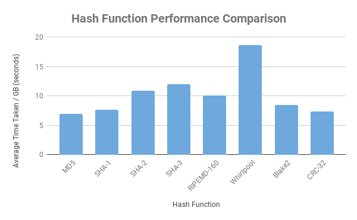

# Hash Benchmarking Script
Performance benchmark of common hashing functions using OpenSSL on Linux.



## Features
- Code is simple, well documented & written from scratch in Python
- Supports the following algorithms:

```
    md5, sha1, sha224, sha3-256, sha-256, ripemd, 
    whirlpool, blake2s-256, crc-32
```

### Requirements
- crctk (https://github.com/2ion/crctk)
- Python 3.x
- Linux OS

